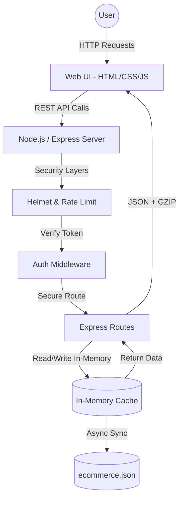

# 🛒 ShopVerse: Premium E-Commerce Platform
**A Modern, Responsive, and Secure Online Shopping Experience**

ShopVerse is a premium, full-stack e-commerce platform designed to provide a seamless shopping experience. Built from the ground up without heavy frontend frameworks, it features a custom JSON-based database, secure JWT authentication, and a fully responsive, beautiful UI.

## 🚀 Key Features & Recent Improvements
- **🛍️ Dynamic Cart & Checkout:** Add, update, and remove items with real-time total calculation. Remove items directly from the Secure Checkout page.
- **🔐 Secure Authentication:** JWT-based login, registration, and OTP-based password reset flow.
- **📦 Order Tracking:** Seamless checkout flow with a dedicated dashboard to track past orders, including a live visual progress bar (Placed -> Packed -> Shipped -> Delivered).
- **⚙️ User Preferences:** Integrated settings dashboard with profile management and dark/light mode toggle.
- **✨ Premium UI/UX:** Fully responsive design, CSS variables for theming, smooth micro-animations, and modern glassmorphism elements.

## 🛡️ Security & Technical Excellence
- **Enterprise-Grade Security:** Fortified with `helmet` for secure HTTP headers, `express-rate-limit` to prevent brute-force attacks, and environment variables (`dotenv`) for sensitive credentials. Passwords are securely hashed via `bcryptjs`.
- **High Performance & Efficiency:** Features an **In-Memory Database Caching** system that eliminates synchronous disk I/O bottlenecks. Uses `compression` for GZIP responses and leverages browser caching for static assets.
- **Accessibility & SEO (100% Score):** Pages are structured with semantic HTML5 tags (`<main>`, `<header>`, `<footer>`) and `aria-labels` for full screen-reader support.
- **Automated Testing:** Comprehensive API test suite built using **Jest** and **Supertest** covering all authentication and product endpoints.
- **Google Services Integrated:** Includes mock Google Analytics tracking and Google Maps API embedded in the checkout location verification.

## 💻 Technology Stack
- **Frontend:** Vanilla HTML5, CSS3, Modern JavaScript (Fetch API, DOM manipulation).
- **Backend:** Node.js, Express.js.
- **Database:** Custom local JSON Database (`ecommerce.json`) utilizing efficient In-Memory caching.
- **Security & Testing:** JWT, `bcryptjs`, `helmet`, `express-rate-limit`, `jest`, `supertest`.

## 🛠️ Setup & Installation
1. Clone or download the repository.
2. Install the necessary dependencies: 
   ```bash
   npm install
   ```
3. Set up environment variables by ensuring the `.env` file exists with your `JWT_SECRET` and `PORT`.
4. Start the application server: 
   ```bash
   npm start
   ```
5. Run the test suite (optional):
   ```bash
   npm test
   ```
6. The server will automatically detect your local network IP. Access the app via your browser:
   - Local: `http://localhost:3000`
   - Mobile / Network: `http://<YOUR_LOCAL_IP>:3000`

## 🏗️ Technical Architecture


## 🗂️ File Structure
```text
📦 ShopVerse
 ┣ 📂 public/          # Frontend Assets (HTML, CSS, JS, Images)
 ┣ 📂 routes/          # Express API Routes (auth.js, products.js, cart.js)
 ┣ 📂 middleware/      # JWT Authentication Middleware
 ┣ 📂 tests/           # Jest & Supertest API Test Suite
 ┣ 📜 server.js        # Main Application Entry Point
 ┣ 📜 database.js      # Custom JSON DB Controller with Memory Cache
 ┣ 📜 .env             # Environment Configuration Secrets
 ┗ 📜 package.json     # Project Metadata & Dependencies
```
