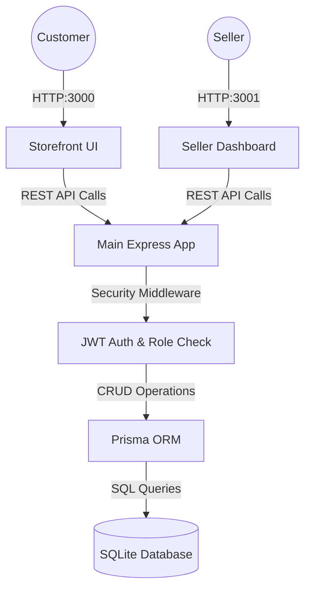

# 🛒 ShopVerse: Premium E-Commerce Platform
**A Modern, Responsive, and Multi-Tenant Online Shopping Experience**


## 🌐 Live Deployment Links
- **🛍️ Main Storefront (For Customers):** [https://shopverse-app-10494438820.us-central1.run.app](https://shopverse-app-10494438820.us-central1.run.app)
  - *Use this link to browse products, add to cart, and checkout.*
- **👨‍💼 Seller Registration & Dashboard:** [https://shopverse-app-10494438820.us-central1.run.app/register?role=seller](https://shopverse-app-10494438820.us-central1.run.app/register?role=seller)
  - *Use this link to create a new Seller account. Once registered, you will automatically be redirected to the Seller Dashboard where you can add products and manage orders.*

ShopVerse is a premium, full-stack e-commerce platform designed to provide a seamless shopping experience for customers and a powerful management dashboard for sellers. Built with a robust backend using Express and Prisma ORM, it features secure cross-domain JWT authentication, role-based access, and a fully responsive, beautiful UI.

## 🚀 Key Features & Recent Improvements
- **👨‍💼 Dual Architecture (Storefront & Seller Dashboard):** The application runs on two separate ports/domains, isolating the customer experience from the seller management interface.
- **🏪 Dedicated Seller Dashboard:** Sellers can manage their inventory, view real-time sales metrics, toggle product availability, and process customer orders (mark shipped, delivered, or reject).
- **🗄️ Relational Database (Prisma + SQLite):** Migrated from a JSON-based database to a robust relational model using Prisma ORM, ensuring data integrity, foreign key constraints, and scalability.
- **🛍️ Dynamic Cart & Checkout:** Add, update, and remove items with real-time total calculation. Remove items directly from the Secure Checkout page.
- **🔐 Secure Authentication:** JWT-based login and registration with cross-port session syncing for a seamless user-to-seller transition.

## 🛡️ Security & Technical Excellence
- **Enterprise-Grade Security:** Fortified with `helmet` for secure HTTP headers, `express-rate-limit` to prevent brute-force attacks, and environment variables (`dotenv`) for sensitive credentials. Passwords are securely hashed via `bcryptjs`.
- **Database Architecture:** Utilizes **Prisma ORM** for type-safe database access, schema migrations, and optimized query performance.
- **Cross-Port Communication:** Implements secure URL-based token passing and sessionStorage validation to maintain user sessions across the isolated Storefront and Seller servers.

## 💻 Technology Stack
- **Frontend:** Vanilla HTML5, CSS3, Modern JavaScript (Fetch API, DOM manipulation).
- **Backend:** Node.js, Express.js.
- **Database & ORM:** SQLite database managed via Prisma ORM.
- **Security & Testing:** JWT, `bcryptjs`, `helmet`, `express-rate-limit`, `jest`, `supertest`.

## 🛠️ Setup & Installation
1. Clone or download the repository.
2. Install the necessary dependencies: 
   ```bash
   npm install
   ```
3. Set up environment variables by ensuring the `.env` file exists with your `JWT_SECRET`.
4. Initialize the Prisma database:
   ```bash
   npx prisma generate
   npx prisma db push
   ```
5. Start both the Storefront and Seller servers simultaneously: 
   ```bash
   npm run both
   ```
6. Access the applications via your browser:
   - **Storefront (Customers):** `http://localhost:3000`
   - **Seller Dashboard:** `http://localhost:3001`

## 🏗️ Technical Architecture


## 🗂️ File Structure
```text
📦 ShopVerse
 ┣ 📂 public/          # Frontend Assets (Storefront & Seller Dash)
 ┣ 📂 routes/          # Express API Routes (auth, products, cart, orders, seller)
 ┣ 📂 middleware/      # JWT Authentication & Seller Authorization
 ┣ 📂 prisma/          # Prisma Schema and SQLite Database File
 ┣ 📜 app.js           # Core Express Application & Global Middleware
 ┣ 📜 server.store.js  # Server Entry Point for Storefront (Port 3000)
 ┣ 📜 server.seller.js # Server Entry Point for Seller Dashboard (Port 3001)
 ┣ 📜 package.json     # Project Metadata & Run Scripts
 ┗ 📜 .env             # Environment Configuration Secrets
```
